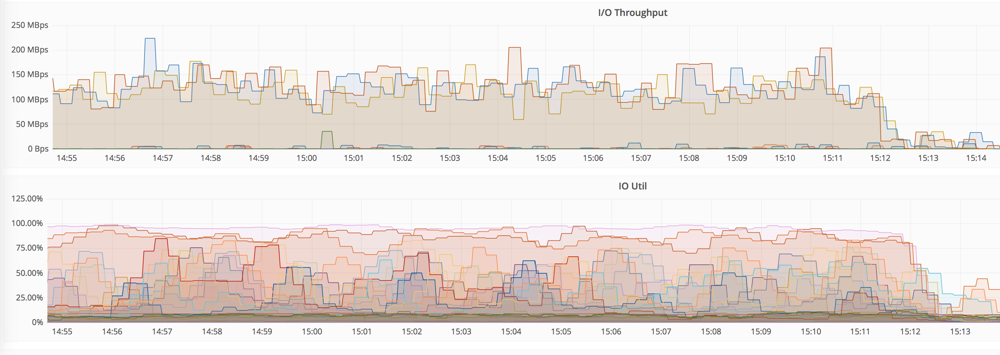
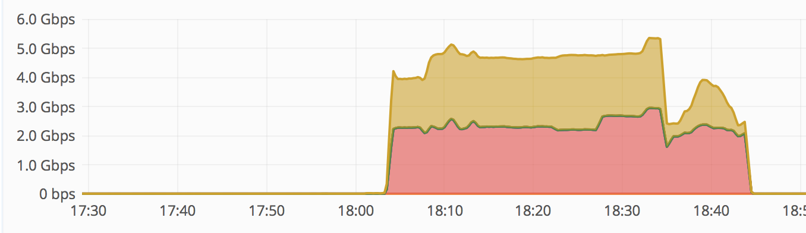
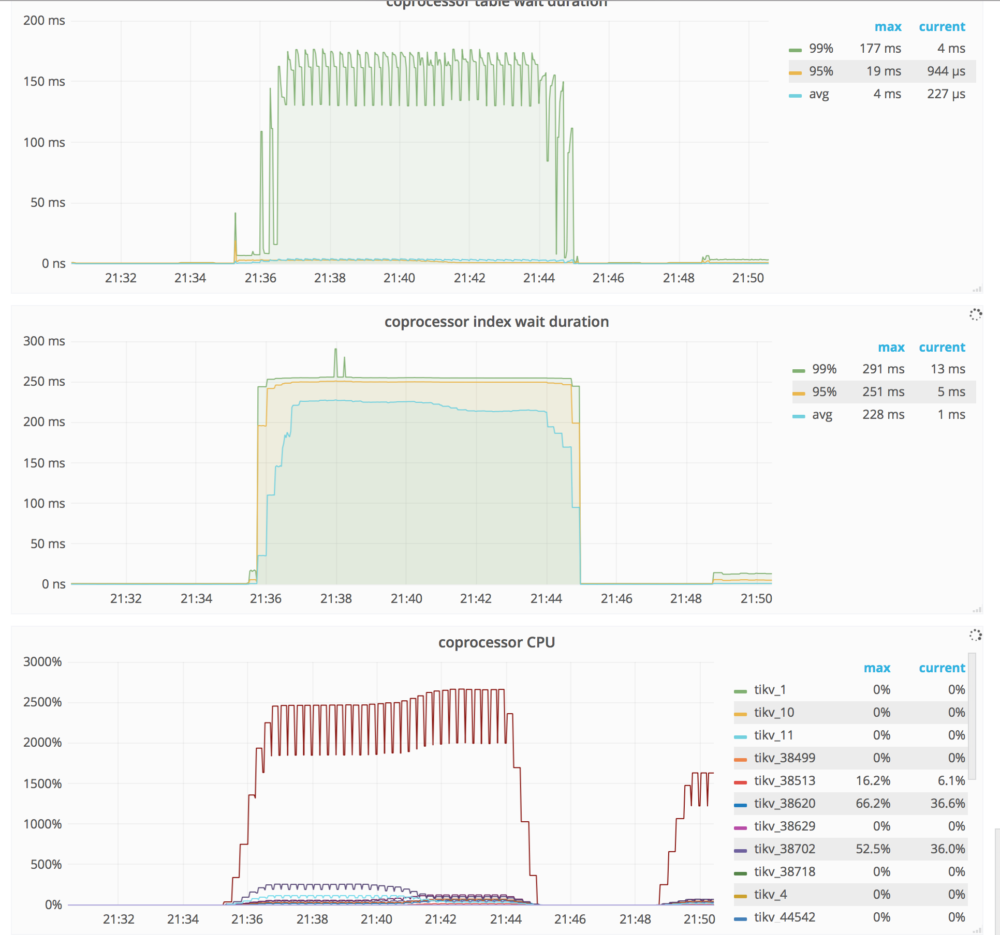

## 机器准备

- crdb，tidb 各三台物理机，40core, 252GiB, 4T * 6

## 数据准备

## 测试场景

以下均使用 sysbench（以下简称sb） 作为压测工具。

### oltp insert

`oltp_insert.sh`，每次 insert 一条数据。

1. PK自增的 insert 场景


| tidb 节点个数 | qps                | 95th latency | max latency |
| --------- | ------------------ | ------------ | ----------- |
| 1         | 5556               | 3.3          | 1152        |
| 2         | 3818 +  3764       | 5.6          | 1675        |
| 3         | 3040 + 3081 + 3062 | 7.1          | 1568        |

```
env tables=8 events=1000000 ./oltp_insert.sh

SQL statistics:
    queries performed:
        read:                            0
        write:                           1000000
        other:                           0
        total:                           1000000
    transactions:                        1000000 (5556.77 per sec.)
    queries:                             1000000 (5556.77 per sec.)
    ignored errors:                      0      (0.00 per sec.)
    reconnects:                          0      (0.00 per sec.)

General statistics:
    total time:                          179.9585s
    total number of events:              1000000

Latency (ms):
         min:                                  1.40
         avg:                                  2.88
         max:                               1152.24
         95th percentile:                      3.30
         sum:                            2878281.61

Threads fairness:
    events (avg/stddev):           62500.0000/99.39
    execution time (avg/stddev):   179.8926/0.01
```


```
env tables=8 events=10000000 ./oltp_insert.sh

## 1
SQL statistics:
    queries performed:
        read:                            0
        write:                           10000000
        other:                           0
        total:                           10000000
    transactions:                        10000000 (3818.39 per sec.)
    queries:                             10000000 (3818.39 per sec.)
    ignored errors:                      0      (0.00 per sec.)
    reconnects:                          0      (0.00 per sec.)

General statistics:
    total time:                          2618.9054s
    total number of events:              10000000

Latency (ms):
         min:                                  1.43
         avg:                                  4.19
         max:                               1675.88
         95th percentile:                      5.67
         sum:                            41892327.51

Threads fairness:
    events (avg/stddev):           625000.0000/613.97
    execution time (avg/stddev):   2618.2705/0.04

## 2
SQL statistics:
    queries performed:
        read:                            0
        write:                           10000000
        other:                           0
        total:                           10000000
    transactions:                        10000000 (3764.72 per sec.)
    queries:                             10000000 (3764.72 per sec.)
    ignored errors:                      0      (0.00 per sec.)
    reconnects:                          0      (0.00 per sec.)

General statistics:
    total time:                          2656.2413s
    total number of events:              10000000

Latency (ms):
         min:                                  1.47
         avg:                                  4.25
         max:                               1675.93
         95th percentile:                      5.57
         sum:                            42472993.19

Threads fairness:
    events (avg/stddev):           625000.0000/648.66
    execution time (avg/stddev):   2654.5621/0.05
```


```
### env tables=8 events=2000000 ./oltp_insert.sh

## 1
SQL statistics:
    queries performed:
        read:                            0
        write:                           2000000
        other:                           0
        total:                           2000000
    transactions:                        2000000 (3040.78 per sec.)
    queries:                             2000000 (3040.78 per sec.)
    ignored errors:                      0      (0.00 per sec.)
    reconnects:                          0      (0.00 per sec.)

General statistics:
    total time:                          657.7238s
    total number of events:              2000000

Latency (ms):
         min:                                  1.55
         avg:                                  5.26
         max:                               1567.64
         95th percentile:                      7.04
         sum:                            10517924.68

Threads fairness:
    events (avg/stddev):           125000.0000/245.01
    execution time (avg/stddev):   657.3703/0.01

## 2
SQL statistics:
    queries performed:
        read:                            0
        write:                           2000000
        other:                           0
        total:                           2000000
    transactions:                        2000000 (3081.35 per sec.)
    queries:                             2000000 (3081.35 per sec.)
    ignored errors:                      0      (0.00 per sec.)
    reconnects:                          0      (0.00 per sec.)

General statistics:
    total time:                          649.0643s
    total number of events:              2000000

Latency (ms):
         min:                                  1.47
         avg:                                  5.19
         max:                               1569.35
         95th percentile:                      7.17
         sum:                            10382837.10

Threads fairness:
    events (avg/stddev):           125000.0000/216.78
    execution time (avg/stddev):   648.9273/0.01

## 3
SQL statistics:
    queries performed:
        read:                            0
        write:                           2000000
        other:                           0
        total:                           2000000
    transactions:                        2000000 (3062.69 per sec.)
    queries:                             2000000 (3062.69 per sec.)
    ignored errors:                      0      (0.00 per sec.)
    reconnects:                          0      (0.00 per sec.)

General statistics:
    total time:                          653.0184s
    total number of events:              2000000

Latency (ms):
         min:                                  1.53
         avg:                                  5.22
         max:                               1568.29
         95th percentile:                      7.04
         sum:                            10442703.77

Threads fairness:
    events (avg/stddev):           125000.0000/148.39
    execution time (avg/stddev):   652.6690/0.01
```


1. PK随机的 insert 场景

- [ ] 待完善，一个简单的测试结果如下

```
> env tables=8 events=3000000 auto_inc=off ./oltp_insert.sh

SQL statistics:
    queries performed:
        read:                            0
        write:                           3000000
        other:                           0
        total:                           3000000
    transactions:                        3000000 (6149.80 per sec.)
    queries:                             3000000 (6149.80 per sec.)
    ignored errors:                      0      (0.00 per sec.)
    reconnects:                          0      (0.00 per sec.)

General statistics:
    total time:                          487.8185s
    total number of events:              3000000

Latency (ms):
         min:                                  1.40
         avg:                                  2.60
         max:                              11954.60
         95th percentile:                      2.97
         sum:                            7801022.79

Threads fairness:
    events (avg/stddev):           187500.0000/323.36
    execution time (avg/stddev):   487.5639/0.02
```


### oltp buck upsert

一个表一个线程，批量去写。共 16 个表。

`INSERT INTO %s (k, c, pad) VALUES(%d, '%s', '%s'), (%d, '%s', '%s')...`

| bench 个数 | tps/qps                               | avg/95% latency | max latency |
| -------- | ------------------------------------- | --------------- | ----------- |
| 1        | 29454/11                              | 0.54/0.01       | 25413       |
| 3        | (15188+15620+ 15768)/(5.68+ 5.85+5.9) | 1.01/0.01       | 58914       |

IO是瓶颈




```
> env mysql_db=oltp_read_only tables=16 table_size=2000000 threads=16 events=16000000 ./oltp_batch_insert.sh
SQL statistics:
    queries performed:
        read:                            0
        write:                           5988
        other:                           0
        total:                           5988
    transactions:                        16000000 (29454.05 per sec.)
    queries:                             5988   (11.02 per sec.)
    ignored errors:                      0      (0.00 per sec.)
    reconnects:                          0      (0.00 per sec.)

General statistics:
    total time:                          543.2169s
    total number of events:              16000000

Latency (ms):
         min:                                  0.01
         avg:                                  0.54
         max:                              25413.24
         95th percentile:                      0.01
         sum:                            8672438.36

Threads fairness:
    events (avg/stddev):           1000000.0000/614913.86
    execution time (avg/stddev):   542.0274/0.64

-------------
IO 基本已经跑满。
```


```
> env mysql_db=oltp_read_only tables=16 table_size=2000000 threads=16 events=16000000 ./oltp_batch_insert.sh
## 1
SQL statistics:
    queries performed:
        read:                            0
        write:                           5988
        other:                           0
        total:                           5988
    transactions:                        16000000 (15188.84 per sec.)
    queries:                             5988   (5.68 per sec.)
    ignored errors:                      0      (0.00 per sec.)
    reconnects:                          0      (0.00 per sec.)

General statistics:
    total time:                          1053.4025s
    total number of events:              16000000

Latency (ms):
         min:                                  0.01
         avg:                                  1.05
         max:                              44627.51
         95th percentile:                      0.01
         sum:                            16832525.03

Threads fairness:
    events (avg/stddev):           1000000.0000/719049.97
    execution time (avg/stddev):   1052.0328/0.54

## 2
SQL statistics:
    queries performed:
        read:                            0
        write:                           5988
        other:                           0
        total:                           5988
    transactions:                        16000000 (15620.93 per sec.)
    queries:                             5988   (5.85 per sec.)
    ignored errors:                      0      (0.00 per sec.)
    reconnects:                          0      (0.00 per sec.)

General statistics:
    total time:                          1024.2645s
    total number of events:              16000000

Latency (ms):
         min:                                  0.01
         avg:                                  1.02
         max:                              58914.36
         95th percentile:                      0.01
         sum:                            16357943.95

Threads fairness:
    events (avg/stddev):           1000000.0000/767703.42
    execution time (avg/stddev):   1022.3715/0.45

## 3
SQL statistics:
    queries performed:
        read:                            0
        write:                           5988
        other:                           0
        total:                           5988
    transactions:                        16000000 (15768.15 per sec.)
    queries:                             5988   (5.90 per sec.)
    ignored errors:                      0      (0.00 per sec.)
    reconnects:                          0      (0.00 per sec.)

General statistics:
    total time:                          1014.7015s
    total number of events:              16000000

Latency (ms):
         min:                                  0.01
         avg:                                  1.01
         max:                              49112.71
         95th percentile:                      0.01
         sum:                            16142005.78

Threads fairness:
    events (avg/stddev):           1000000.0000/692012.93
    execution time (avg/stddev):   1008.8754/2.38
```


### oltp point select

`SELECT c FROM sbtest%u WHERE id=?`

cmd: `env mysql_db=oltp_read_only tables=16 table_size=2000000 threads=16 events=10000000 ./oltp_point_select.sh`

| bench num | qps               | 95%  | avg  | max  |
| --------- | ----------------- | ---- | ---- | ---- |
| 1         | 26525             | 0.77 | 0.60 | 38.6 |
| 2         | 23100 + 23132     | 1.0  | 0.69 | 29   |
| 3         | 20008+20066+20334 | 1.3  | 0.8  | 157  |

基本上 point select 吞吐量线性增长。这里不多说了

one bench:

```
SQL statistics:
    queries performed:
        read:                            10000000
        write:                           0
        other:                           0
        total:                           10000000
    transactions:                        10000000 (26525.05 per sec.)
    queries:                             10000000 (26525.05 per sec.)
    ignored errors:                      0      (0.00 per sec.)
    reconnects:                          0      (0.00 per sec.)

General statistics:
    total time:                          376.9999s
    total number of events:              10000000

Latency (ms):
         min:                                  0.36
         avg:                                  0.60
         max:                                 38.62
         95th percentile:                      0.77
         sum:                            6027872.54

Threads fairness:
    events (avg/stddev):           625000.0000/748.73
    execution time (avg/stddev):   376.7420/0.02
```

two bench:

```
## 1
SQL statistics:
    queries performed:
        read:                            10000000
        write:                           0
        other:                           0
        total:                           10000000
    transactions:                        10000000 (23100.05 per sec.)
    queries:                             10000000 (23100.05 per sec.)
    ignored errors:                      0      (0.00 per sec.)
    reconnects:                          0      (0.00 per sec.)

General statistics:
    total time:                          432.8974s
    total number of events:              10000000

Latency (ms):
         min:                                  0.38
         avg:                                  0.69
         max:                                 29.11
         95th percentile:                      1.08
         sum:                            6922301.16

Threads fairness:
    events (avg/stddev):           625000.0000/742.81
    execution time (avg/stddev):   432.6438/0.02

## 2
SQL statistics:
    queries performed:
        read:                            10000000
        write:                           0
        other:                           0
        total:                           10000000
    transactions:                        10000000 (23132.86 per sec.)
    queries:                             10000000 (23132.86 per sec.)
    ignored errors:                      0      (0.00 per sec.)
    reconnects:                          0      (0.00 per sec.)

General statistics:
    total time:                          432.2832s
    total number of events:              10000000

Latency (ms):
         min:                                  0.36
         avg:                                  0.69
         max:                                 24.71
         95th percentile:                      0.95
         sum:                            6905746.65

Threads fairness:
    events (avg/stddev):           625000.0000/896.61
    execution time (avg/stddev):   431.6092/0.04
```


```
## 1
SQL statistics:
    queries performed:
        read:                            10000000
        write:                           0
        other:                           0
        total:                           10000000
    transactions:                        10000000 (20066.69 per sec.)
    queries:                             10000000 (20066.69 per sec.)
    ignored errors:                      0      (0.00 per sec.)
    reconnects:                          0      (0.00 per sec.)

General statistics:
    total time:                          498.3362s
    total number of events:              10000000

Latency (ms):
         min:                                  0.39
         avg:                                  0.80
         max:                                156.28
         95th percentile:                      1.23
         sum:                            7961690.59

Threads fairness:
    events (avg/stddev):           625000.0000/2393.90
    execution time (avg/stddev):   497.6057/0.08

## 2
SQL statistics:
    queries performed:
        read:                            10000000
        write:                           0
        other:                           0
        total:                           10000000
    transactions:                        10000000 (20008.68 per sec.)
    queries:                             10000000 (20008.68 per sec.)
    ignored errors:                      0      (0.00 per sec.)
    reconnects:                          0      (0.00 per sec.)

General statistics:
    total time:                          499.7810s
    total number of events:              10000000

Latency (ms):
         min:                                  0.37
         avg:                                  0.80
         max:                                157.03
         95th percentile:                      1.32
         sum:                            7985976.16

Threads fairness:
    events (avg/stddev):           625000.0000/1786.62
    execution time (avg/stddev):   499.1235/0.08

## 3
SQL statistics:
    queries performed:
        read:                            10000000
        write:                           0
        other:                           0
        total:                           10000000
    transactions:                        10000000 (20334.82 per sec.)
    queries:                             10000000 (20334.82 per sec.)
    ignored errors:                      0      (0.00 per sec.)
    reconnects:                          0      (0.00 per sec.)

General statistics:
    total time:                          491.7651s
    total number of events:              10000000

Latency (ms):
         min:                                  0.38
         avg:                                  0.79
         max:                                157.20
         95th percentile:                      1.39
         sum:                            7863746.09

Threads fairness:
    events (avg/stddev):           625000.0000/797.55
    execution time (avg/stddev):   491.4841/0.02

```


### oltp read only


每次顺序执行以下操作：（range 起始随机生成，range size 指定）

1. simple range: `SELECT c FROM sbtest%u WHERE id BETWEEN ? AND ?`
2. sum range: `SELECT SUM(k) FROM sbtest%u WHERE id BETWEEN ? AND ?`
3. order range: `SELECT c FROM sbtest%u WHERE id BETWEEN ? AND ? ORDER BY c`
4. distinct order range: `SELECT DISTINCT c FROM sbtest%u WHERE id BETWEEN ? AND ? ORDER BY c`


变量:

- range size
- trx


`env mysql_db=oltp_read_only tables=6 table_size=10000000 threads=64 events=1000000 range_size=1000 skip_trx=off ./oltp_read_only.sh`

**<u>range_size=1000, trx=off</u>**


```
SQL statistics:
    queries performed:
        read:                            14000000
        write:                           0
        other:                           2000000
        total:                           16000000
    transactions:                        1000000 (530.30 per sec.)
    queries:                             16000000 (8484.87 per sec.)
    ignored errors:                      0      (0.00 per sec.)
    reconnects:                          0      (0.00 per sec.)

General statistics:
    total time:                          1885.7079s
    total number of events:              1000000

Latency (ms):
         min:                                 30.13
         avg:                                120.68
         max:                                643.98
         95th percentile:                    170.48
         sum:                            120679713.44

Threads fairness:
    events (avg/stddev):           15625.0000/28.34
    execution time (avg/stddev):   1885.6205/0.02

SQL statistics:
    queries performed:
        read:                            14000000
        write:                           0
        other:                           2000000
        total:                           16000000
    transactions:                        1000000 (540.90 per sec.)
    queries:                             16000000 (8654.34 per sec.)
    ignored errors:                      0      (0.00 per sec.)
    reconnects:                          0      (0.00 per sec.)

General statistics:
    total time:                          1848.7804s
    total number of events:              1000000

Latency (ms):
         min:                                 25.67
         avg:                                118.31
         max:                                593.37
         95th percentile:                    164.45
         sum:                            118314359.31

Threads fairness:
    events (avg/stddev):           15625.0000/40.41
    execution time (avg/stddev):   1848.6619/0.03

SQL statistics:
    queries performed:
        read:                            14000000
        write:                           0
        other:                           2000000
        total:                           16000000
    transactions:                        1000000 (417.96 per sec.)
    queries:                             16000000 (6687.32 per sec.)
    ignored errors:                      0      (0.00 per sec.)
    reconnects:                          0      (0.00 per sec.)

General statistics:
    total time:                          2392.5862s
    total number of events:              1000000

Latency (ms):
         min:                                 23.05
         avg:                                153.12
         max:                                686.26
         95th percentile:                    287.38
         sum:                            153119455.87

Threads fairness:
    events (avg/stddev):           15625.0000/32.48
    execution time (avg/stddev):   2392.4915/0.02
```




### oltp random points

通过索引 random N个 point 出来。

`SELECT id, k, c, pad FROM sbtest1 WHERE k IN (%s)`


变量：

- random_points


`env mysql_db=oltp_read_only table_size=10000000 threads=64 events=100000 random_points=1000  ./oltp_select_random_points.sh`

**<u>random_points=1000</u>**

#### One bench

```
SQL statistics:
    queries performed:
        read:                            100000
        write:                           0
        other:                           0
        total:                           100000
    transactions:                        100000 (405.70 per sec.)
    queries:                             100000 (405.70 per sec.)
    ignored errors:                      0      (0.00 per sec.)
    reconnects:                          0      (0.00 per sec.)

General statistics:
    total time:                          246.4860s
    total number of events:              100000

Latency (ms):
         min:                                 63.07
         avg:                                157.72
         max:                                436.95
         95th percentile:                    211.60
         sum:                            15772122.53

Threads fairness:
    events (avg/stddev):           1562.5000/131.76
    execution time (avg/stddev):   246.4394/0.03
```

现象：

1. tikv 显示 index wait  有5ms。table wait 有不到1ms。
2. tikv CPU 到 1000%。
3. index 集中在一个 store 里。

#### Three bench

```
## 1
SQL statistics:
    queries performed:
        read:                            100000
        write:                           0
        other:                           0
        total:                           100000
    transactions:                        100000 (205.84 per sec.)
    queries:                             100000 (205.84 per sec.)
    ignored errors:                      0      (0.00 per sec.)
    reconnects:                          0      (0.00 per sec.)

General statistics:
    total time:                          485.8233s
    total number of events:              100000

Latency (ms):
         min:                                148.75
         avg:                                310.85
         max:                                670.72
         95th percentile:                    502.20
         sum:                            31084962.80

Threads fairness:
    events (avg/stddev):           1562.5000/218.77
    execution time (avg/stddev):   485.7025/0.06

## 2
SQL statistics:
    queries performed:
        read:                            100000
        write:                           0
        other:                           0
        total:                           100000
    transactions:                        100000 (205.59 per sec.)
    queries:                             100000 (205.59 per sec.)
    ignored errors:                      0      (0.00 per sec.)
    reconnects:                          0      (0.00 per sec.)

General statistics:
    total time:                          486.4009s
    total number of events:              100000

Latency (ms):
         min:                                135.17
         avg:                                311.08
         max:                                654.32
         95th percentile:                    502.20
         sum:                            31107876.61

Threads fairness:
    events (avg/stddev):           1562.5000/218.85
    execution time (avg/stddev):   486.0606/0.11
## 3
SQL statistics:
    queries performed:
        read:                            100000
        write:                           0
        other:                           0
        total:                           100000
    transactions:                        100000 (198.55 per sec.)
    queries:                             100000 (198.55 per sec.)
    ignored errors:                      0      (0.00 per sec.)
    reconnects:                          0      (0.00 per sec.)

General statistics:
    total time:                          503.6546s
    total number of events:              100000

Latency (ms):
         min:                                 72.47
         avg:                                322.31
         max:                                717.04
         95th percentile:                    520.62
         sum:                            32230945.30

Threads fairness:
    events (avg/stddev):           1562.5000/208.81
    execution time (avg/stddev):   503.6085/0.03
```




现象：

1. tikv 显示 index wait  大概有250ms。table wait 大概有 20ms。
2. tikv CPU 到 2500%。
3. index 集中在一个 store 里。

### oltp random ranges

多个 range 组合： `SELECT count(k) FROM sbtest1 WHERE (k BETWEEN ? AND ?) OR (k BETWEEN ? AND ?) OR (k BETWEEN ? AND ?) ... `


变量：

- number_of_ranges
- range_size


`env mysql_db=oltp_read_only table_size=10000000 threads=64 events=100000 number_of_ranges=10 delta=100  ./oltp_select_random_ranges.sh`

**<u>number_of_ranges=10, range_size=100</u>**

```
SQL statistics:
    queries performed:
        read:                            100000
        write:                           0
        other:                           0
        total:                           100000
    transactions:                        100000 (4280.62 per sec.)
    queries:                             100000 (4280.62 per sec.)
    ignored errors:                      0      (0.00 per sec.)
    reconnects:                          0      (0.00 per sec.)

General statistics:
    total time:                          23.3590s
    total number of events:              100000

Latency (ms):
         min:                                  2.96
         avg:                                 14.93
         max:                                168.93
         95th percentile:                     25.74
         sum:                            1492807.42

Threads fairness:
    events (avg/stddev):           1562.5000/163.47
    execution time (avg/stddev):   23.3251/0.00

```


**<u>number_of_ranges=50, range_size=100</u>**

```
SQL statistics:
    queries performed:
        read:                            100000
        write:                           0
        other:                           0
        total:                           100000
    transactions:                        100000 (786.68 per sec.)
    queries:                             100000 (786.68 per sec.)
    ignored errors:                      0      (0.00 per sec.)
    reconnects:                          0      (0.00 per sec.)

General statistics:
    total time:                          127.1141s
    total number of events:              100000

Latency (ms):
         min:                                 17.17
         avg:                                 81.34
         max:                                424.49
         95th percentile:                    123.28
         sum:                            8134102.90

Threads fairness:
    events (avg/stddev):           1562.5000/113.90
    execution time (avg/stddev):   127.0954/0.01
```


**<u>number_of_ranges=100, range_size=100</u>**

```
SQL statistics:
    queries performed:
        read:                            100000
        write:                           0
        other:                           0
        total:                           100000
    transactions:                        100000 (360.02 per sec.)
    queries:                             100000 (360.02 per sec.)
    ignored errors:                      0      (0.00 per sec.)
    reconnects:                          0      (0.00 per sec.)

General statistics:
    total time:                          277.7583s
    total number of events:              100000

Latency (ms):
         min:                                 65.19
         avg:                                177.67
         max:                                630.01
         95th percentile:                    253.35
         sum:                            17767029.96

Threads fairness:
    events (avg/stddev):           1562.5000/103.37
    execution time (avg/stddev):   277.6098/0.04
```


思考:

1. 对于连续 skip scan 的查询，比较耗费CPU。这是 rocksdb 和磁盘本身性质决定的。


### Update Index

`UPDATE sbtest%u SET k=k+1 WHERE id=?`

随机生成 id，更新它的索引值 k。（只更新一张表）


env mysql_db=oltp_read_only tables=1 table_size=70000000 threads=128 events=1000000 ./oltp_update_index.sh

```
SQL statistics:
    queries performed:
        read:                            0
        write:                           1000000
        other:                           0
        total:                           1000000
    transactions:                        1000000 (11359.39 per sec.)
    queries:                             1000000 (11359.39 per sec.)
    ignored errors:                      0      (0.00 per sec.)
    reconnects:                          0      (0.00 per sec.)

General statistics:
    total time:                          88.0308s
    total number of events:              1000000

Latency (ms):
         min:                                  1.81
         avg:                                 11.27
         max:                               4438.94
         95th percentile:                     19.65
         sum:                            11266034.93

Threads fairness:
    events (avg/stddev):           7812.5000/91.92
    execution time (avg/stddev):   88.0159/0.00
```


```
## 1
SQL statistics:
    queries performed:
        read:                            0
        write:                           400000
        other:                           0
        total:                           400000
    transactions:                        400000 (4595.58 per sec.)
    queries:                             400000 (4595.58 per sec.)
    ignored errors:                      0      (0.00 per sec.)
    reconnects:                          0      (0.00 per sec.)

General statistics:
    total time:                          87.0380s
    total number of events:              400000

Latency (ms):
         min:                                  1.90
         avg:                                 27.83
         max:                               4623.44
         95th percentile:                     43.39
         sum:                            11132064.35

Threads fairness:
    events (avg/stddev):           3125.0000/35.11
    execution time (avg/stddev):   86.9693/0.01

SQL statistics:
    queries performed:
        read:                            0
        write:                           400000
        other:                           0
        total:                           400000
    transactions:                        400000 (4651.90 per sec.)
    queries:                             400000 (4651.90 per sec.)
    ignored errors:                      0      (0.00 per sec.)
    reconnects:                          0      (0.00 per sec.)
## 2
General statistics:
    total time:                          85.9841s
    total number of events:              400000

Latency (ms):
         min:                                  1.97
         avg:                                 27.51
         max:                               5362.06
         95th percentile:                     41.85
         sum:                            11003196.75

Threads fairness:
    events (avg/stddev):           3125.0000/42.66
    execution time (avg/stddev):   85.9625/0.01
## 3
SQL statistics:
    queries performed:
        read:                            0
        write:                           400000
        other:                           0
        total:                           400000
    transactions:                        400000 (4687.66 per sec.)
    queries:                             400000 (4687.66 per sec.)
    ignored errors:                      0      (0.00 per sec.)
    reconnects:                          0      (0.00 per sec.)

General statistics:
    total time:                          85.3282s
    total number of events:              400000

Latency (ms):
         min:                                  1.93
         avg:                                 27.28
         max:                               5702.88
         95th percentile:                     42.61
         sum:                            10912419.58

Threads fairness:
    events (avg/stddev):           3125.0000/46.31
    execution time (avg/stddev):   85.2533/0.01
```

此时出现prepare_write error，写竞争了，观察 pending task 也是有的。


再往上压，延迟增加，pending task 增加。


### Update non Index

`UPDATE sbtest%u SET c=? WHERE id=?`

随机生成 id，更新它的值 c。（只更新一张表）


`env mysql_db=oltp_read_only tables=1 table_size=70000000 threads=128 events=1000000 ./oltp_update_non_index.sh`

```
SQL statistics:
    queries performed:
        read:                            0
        write:                           1000000
        other:                           0
        total:                           1000000
    transactions:                        1000000 (15034.36 per sec.)
    queries:                             1000000 (15034.36 per sec.)
    ignored errors:                      0      (0.00 per sec.)
    reconnects:                          0      (0.00 per sec.)

General statistics:
    total time:                          66.5122s
    total number of events:              1000000

Latency (ms):
         min:                                  1.65
         avg:                                  8.48
         max:                                668.80
         95th percentile:                     13.46
         sum:                            8484868.18

Threads fairness:
    events (avg/stddev):           7812.5000/77.08
    execution time (avg/stddev):   66.2880/0.13
```

```
## 1
SQL statistics:
    queries performed:
        read:                            0
        write:                           500000
        other:                           0
        total:                           500000
    transactions:                        500000 (8570.81 per sec.)
    queries:                             500000 (8570.81 per sec.)
    ignored errors:                      0      (0.00 per sec.)
    reconnects:                          0      (0.00 per sec.)

General statistics:
    total time:                          58.3354s
    total number of events:              500000

Latency (ms):
         min:                                  1.65
         avg:                                 29.86
         max:                               1059.56
         95th percentile:                     65.65
         sum:                            14928212.51

Threads fairness:
    events (avg/stddev):           1953.1250/38.22
    execution time (avg/stddev):   58.3133/0.01

## 2
SQL statistics:
    queries performed:
        read:                            0
        write:                           500000
        other:                           0
        total:                           500000
    transactions:                        500000 (8795.15 per sec.)
    queries:                             500000 (8795.15 per sec.)
    ignored errors:                      0      (0.00 per sec.)
    reconnects:                          0      (0.00 per sec.)

General statistics:
    total time:                          56.8474s
    total number of events:              500000

Latency (ms):
         min:                                  1.54
         avg:                                 29.09
         max:                               1062.60
         95th percentile:                     62.19
         sum:                            14545510.55

Threads fairness:
    events (avg/stddev):           1953.1250/33.72
    execution time (avg/stddev):   56.8184/0.01

## 3
SQL statistics:
    queries performed:
        read:                            0
        write:                           500000
        other:                           0
        total:                           500000
    transactions:                        500000 (8601.60 per sec.)
    queries:                             500000 (8601.60 per sec.)
    ignored errors:                      0      (0.00 per sec.)
    reconnects:                          0      (0.00 per sec.)

General statistics:
    total time:                          58.1266s
    total number of events:              500000

Latency (ms):
         min:                                  1.63
         avg:                                 29.75
         max:                               1062.72
         95th percentile:                     65.65
         sum:                            14875526.89

Threads fairness:
    events (avg/stddev):           1953.1250/35.54
    execution time (avg/stddev):   58.1075/0.00
```

内部出现 prepare write error，再压下去，tidb 重试的次数可能会增大。


再提高并发，无法增大吞吐量，因为延迟开始增加。


```
SQL statistics:
    queries performed:
        read:                            0
        write:                           500000
        other:                           0
        total:                           500000
    transactions:                        500000 (9499.13 per sec.)
    queries:                             500000 (9499.13 per sec.)
    ignored errors:                      0      (0.00 per sec.)
    reconnects:                          0      (0.00 per sec.)

General statistics:
    total time:                          52.6343s
    total number of events:              500000

Latency (ms):
         min:                                  1.59
         avg:                                 53.79
         max:                               1368.40
         95th percentile:                    118.92
         sum:                            26894974.62

Threads fairness:
    events (avg/stddev):           976.5625/31.13
    execution time (avg/stddev):   52.5292/0.01

SQL statistics:
    queries performed:
        read:                            0
        write:                           500000
        other:                           0
        total:                           500000
    transactions:                        500000 (9418.91 per sec.)
    queries:                             500000 (9418.91 per sec.)
    ignored errors:                      0      (0.00 per sec.)
    reconnects:                          0      (0.00 per sec.)

General statistics:
    total time:                          53.0825s
    total number of events:              500000

Latency (ms):
         min:                                  1.65
         avg:                                 54.26
         max:                               1351.11
         95th percentile:                    118.92
         sum:                            27130553.14

Threads fairness:
    events (avg/stddev):           976.5625/32.76
    execution time (avg/stddev):   52.9894/0.02

SQL statistics:
    queries performed:
        read:                            0
        write:                           500000
        other:                           0
        total:                           500000
    transactions:                        500000 (9752.01 per sec.)
    queries:                             500000 (9752.01 per sec.)
    ignored errors:                      0      (0.00 per sec.)
    reconnects:                          0      (0.00 per sec.)

General statistics:
    total time:                          51.2693s
    total number of events:              500000

Latency (ms):
         min:                                  1.53
         avg:                                 52.41
         max:                               1380.21
         95th percentile:                    116.80
         sum:                            26206639.03

Threads fairness:
    events (avg/stddev):           976.5625/60.60
    execution time (avg/stddev):   51.1848/0.03

```

