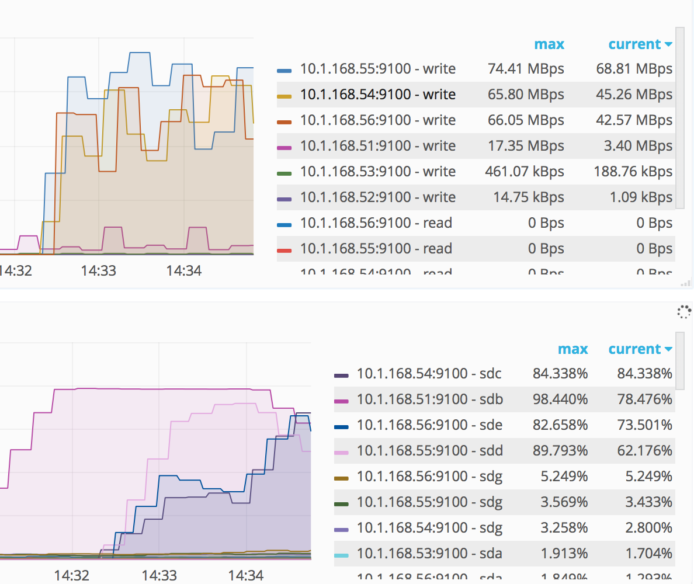

# TiDB vs CockroachDB Bench

## 部署
40core + 252GiB + 2T * 6 个 7200 转磁盘

- CRDB: 总共三个 crdb 实例，一个实例 6 个store。
- TiDB: 总共 5 * 3 个实例，一个实例 1 个 store。

压测表

```
    CREATE TABLE IF NOT EXISTS sbtest1(
      id INTEGER NOT NULL,
      k INTEGER DEFAULT '0' NOT NULL,
      c CHAR(120) DEFAULT '' NOT NULL,
      pad CHAR(60) DEFAULT '' NOT NULL,
      PRIMARY KEY (id)
    );
    CREATE INDEX IF NOT EXISTS k_1 ON sbtest1(k)
```

**Buck insert（主键自增）**

|      |           |                          |
| ---- | --------- | ------------------------ |
| crdb | 2000 tps  | 三个实例中各有一块磁盘IO 达到了 90% 多。 |
| tidb | 20000 tps | 基本同上。写入主要受 IO 影响。        |


    [ 8270s ] thds: 4 tps: 1330.51 qps: 0.50 (r/w/o: 0.00/0.50/0.00) lat (ms,95%): 0.01 err/s: 0.00 reconn/s: 0.00
    [ 8272s ] thds: 4 tps: 2661.19 qps: 1.00 (r/w/o: 0.00/1.00/0.00) lat (ms,95%): 0.01 err/s: 0.00 reconn/s: 0.00
    [ 8274s ] thds: 4 tps: 1330.40 qps: 0.50 (r/w/o: 0.00/0.50/0.00) lat (ms,95%): 0.01 err/s: 0.00 reconn/s: 0.00
    [ 8276s ] thds: 4 tps: 2661.25 qps: 1.00 (r/w/o: 0.00/1.00/0.00) lat (ms,95%): 0.01 err/s: 0.00 reconn/s: 0.00
    [ 8278s ] thds: 4 tps: 1330.47 qps: 0.50 (r/w/o: 0.00/0.50/0.00) lat (ms,95%): 0.01 err/s: 0.00 reconn/s: 0.00
    [ 8280s ] thds: 4 tps: 2661.04 qps: 1.00 (r/w/o: 0.00/1.00/0.00) lat (ms,95%): 0.01 err/s: 0.00 reconn/s: 0.00
    [ 8282s ] thds: 4 tps: 2660.79 qps: 1.00 (r/w/o: 0.00/1.00/0.00) lat (ms,95%): 0.01 err/s: 0.00 reconn/s: 0.00
    [ 8284s ] thds: 4 tps: 2661.25 qps: 1.00 (r/w/o: 0.00/1.00/0.00) lat (ms,95%): 0.01 err/s: 0.00 reconn/s: 0.00
    [ 8286s ] thds: 4 tps: 0.00 qps: 0.00 (r/w/o: 0.00/0.00/0.00) lat (ms,95%): 0.00 err/s: 0.00 reconn/s: 0.00
    [ 8288s ] thds: 4 tps: 3991.51 qps: 1.50 (r/w/o: 0.00/1.50/0.00) lat (ms,95%): 0.01 err/s: 0.00 reconn/s: 0.00


    [ 22s ] thds: 10 tps: 4010.97 qps: 1.50 (r/w/o: 0.00/1.50/0.00) lat (ms,95%): 0.01 err/s: 0.00 reconn/s: 0.00
    [ 24s ] thds: 10 tps: 17380.86 qps: 6.50 (r/w/o: 0.00/6.50/0.00) lat (ms,95%): 0.01 err/s: 0.00 reconn/s: 0.00
    [ 26s ] thds: 10 tps: 30751.33 qps: 11.50 (r/w/o: 0.00/11.50/0.00) lat (ms,95%): 0.01 err/s: 0.00 reconn/s: 0.00
    [ 28s ] thds: 10 tps: 30750.71 qps: 11.50 (r/w/o: 0.00/11.50/0.00) lat (ms,95%): 0.01 err/s: 0.00 reconn/s: 0.00
    [ 30s ] thds: 10 tps: 29414.02 qps: 11.00 (r/w/o: 0.00/11.00/0.00) lat (ms,95%): 0.01 err/s: 0.00 reconn/s: 0.00
    [ 32s ] thds: 10 tps: 16044.25 qps: 6.00 (r/w/o: 0.00/6.00/0.00) lat (ms,95%): 0.01 err/s: 0.00 reconn/s: 0.00
    [ 34s ] thds: 10 tps: 29413.69 qps: 11.00 (r/w/o: 0.00/11.00/0.00) lat (ms,95%): 0.01 err/s: 0.00 reconn/s: 0.00
    [ 36s ] thds: 10 tps: 17380.97 qps: 6.50 (r/w/o: 0.00/6.50/0.00) lat (ms,95%): 0.01 err/s: 0.00 reconn/s: 0.00
    [ 38s ] thds: 10 tps: 24066.26 qps: 9.00 (r/w/o: 0.00/9.00/0.00) lat (ms,95%): 0.01 err/s: 0.00 reconn/s: 0.00
    [ 40s ] thds: 10 tps: 29414.00 qps: 11.00 (r/w/o: 0.00/11.00/0.00) lat (ms,95%): 0.01 err/s: 0.00 reconn/s: 0.00


**Bulk Insert（主键不自增）**

非自增情况: 压测结果基本同上。

TiDB


    WARNING: Both event and time limits are disabled, running an endless test
    sysbench 1.1.0-648539f (using bundled LuaJIT 2.1.0-beta3)

    Running the test with following options:
    Number of threads: 8
    Report intermediate results every 2 second(s)
    Initializing random number generator from current time


    Initializing worker threads...

    Threads started!

    [ 2s ] thds: 8 tps: 32276.54 qps: 8.49 (r/w/o: 0.00/8.49/0.00) lat (ms,95%): 0.00 err/s: 0.00 reconn/s: 0.00
    [ 4s ] thds: 8 tps: 16803.57 qps: 6.50 (r/w/o: 0.00/6.50/0.00) lat (ms,95%): 0.00 err/s: 0.00 reconn/s: 0.00
    [ 6s ] thds: 8 tps: 27130.48 qps: 10.50 (r/w/o: 0.00/10.50/0.00) lat (ms,95%): 0.00 err/s: 0.00 reconn/s: 0.00
    [ 8s ] thds: 8 tps: 25832.90 qps: 10.00 (r/w/o: 0.00/10.00/0.00) lat (ms,95%): 0.00 err/s: 0.00 reconn/s: 0.00
    [ 10s ] thds: 8 tps: 25833.08 qps: 10.00 (r/w/o: 0.00/10.00/0.00) lat (ms,95%): 0.00 err/s: 0.00 reconn/s: 0.00
    [ 12s ] thds: 8 tps: 23257.66 qps: 9.00 (r/w/o: 0.00/9.00/0.00) lat (ms,95%): 0.00 err/s: 0.00 reconn/s: 0.00
    [ 14s ] thds: 8 tps: 24541.98 qps: 9.50 (r/w/o: 0.00/9.50/0.00) lat (ms,95%): 0.00 err/s: 0.00 reconn/s: 0.00
    [ 16s ] thds: 8 tps: 21959.78 qps: 8.50 (r/w/o: 0.00/8.50/0.00) lat (ms,95%): 0.00 err/s: 0.00 reconn/s: 0.00
    [ 18s ] thds: 8 tps: 27124.15 qps: 10.50 (r/w/o: 0.00/10.50/0.00) lat (ms,95%): 0.00 err/s: 0.00 reconn/s: 0.00
    [ 20s ] thds: 8 tps: 23257.52 qps: 9.00 (r/w/o: 0.00/9.00/0.00) lat (ms,95%): 0.00 err/s: 0.00 reconn/s: 0.00
    [ 22s ] thds: 8 tps: 16789.49 qps: 6.50 (r/w/o: 0.00/6.50/0.00) lat (ms,95%): 0.00 err/s: 0.00 reconn/s: 0.00
    [ 24s ] thds: 8 tps: 19378.16 qps: 7.50 (r/w/o: 0.00/7.50/0.00) lat (ms,95%): 0.00 err/s: 0.00 reconn/s: 0.00
    [ 26s ] thds: 8 tps: 23250.73 qps: 9.00 (r/w/o: 0.00/9.00/0.00) lat (ms,95%): 0.00 err/s: 0.00 reconn/s: 0.00
    [ 28s ] thds: 8 tps: 24548.47 qps: 9.50 (r/w/o: 0.00/9.50/0.00) lat (ms,95%): 0.00 err/s: 0.00 reconn/s: 0.00
    [ 30s ] thds: 8 tps: 24548.94 qps: 9.50 (r/w/o: 0.00/9.50/0.00) lat (ms,95%): 0.00 err/s: 0.00 reconn/s: 0.00
    [ 32s ] thds: 8 tps: 27130.20 qps: 10.50 (r/w/o: 0.00/10.50/0.00) lat (ms,95%): 0.00 err/s: 0.00 reconn/s: 0.00
    [ 34s ] thds: 8 tps: 27114.79 qps: 10.50 (r/w/o: 0.00/10.50/0.00) lat (ms,95%): 0.00 err/s: 0.00 reconn/s: 0.00
    [ 36s ] thds: 8 tps: 21946.75 qps: 8.50 (r/w/o: 0.00/8.50/0.00) lat (ms,95%): 0.00 err/s: 0.00 reconn/s: 0.00
    [ 38s ] thds: 8 tps: 24528.84 qps: 9.50 (r/w/o: 0.00/9.50/0.00) lat (ms,95%): 0.00 err/s: 0.00 reconn/s: 0.00
    [ 40s ] thds: 8 tps: 23238.01 qps: 9.00 (r/w/o: 0.00/9.00/0.00) lat (ms,95%): 0.00 err/s: 0.00 reconn/s: 0.00
    [ 42s ] thds: 8 tps: 13973.10 qps: 7.00 (r/w/o: 0.00/7.00/0.00) lat (ms,95%): 0.00 err/s: 0.00 reconn/s: 0.00
    time_total(s), events, reads, writes, other, total, trans, queries, errors, trans/time_total(per sec), queries/time_total(per sec), errors/time_total(per sec), reconnects, reconnects/time_total(per sec), latency_min(ms), latency_avg(ms), latency_pct(ms), latency_max(ms),latency_sum(ms)
      43, 999992, 0, 392, 0, 392, 999992, 392, 0, 23025.25, 9.03, 0.00, 0, 0.00, 0.00, 0.34, 0.00, 2584.65, 337655.05

CockroachDB


    WARNING: Both event and time limits are disabled, running an endless test
    sysbench 1.1.0-648539f (using bundled LuaJIT 2.1.0-beta3)

    Running the test with following options:
    Number of threads: 8
    Report intermediate results every 2 second(s)
    Initializing random number generator from current time


    Initializing worker threads...

    Threads started!

    [ 2s ] thds: 8 tps: 18071.25 qps: 2.99 (r/w/o: 0.00/2.99/0.00) lat (ms,95%): 0.00 err/s: 0.00 reconn/s: 0.00
    [ 4s ] thds: 8 tps: 7760.14 qps: 3.00 (r/w/o: 0.00/3.00/0.00) lat (ms,95%): 0.00 err/s: 0.00 reconn/s: 0.00
    [ 6s ] thds: 8 tps: 10340.56 qps: 4.00 (r/w/o: 0.00/4.00/0.00) lat (ms,95%): 0.00 err/s: 0.00 reconn/s: 0.00
    [ 8s ] thds: 8 tps: 10333.96 qps: 4.00 (r/w/o: 0.00/4.00/0.00) lat (ms,95%): 0.00 err/s: 0.00 reconn/s: 0.00
    [ 10s ] thds: 8 tps: 9043.46 qps: 3.50 (r/w/o: 0.00/3.50/0.00) lat (ms,95%): 0.00 err/s: 0.00 reconn/s: 0.00
    [ 12s ] thds: 8 tps: 10335.00 qps: 4.00 (r/w/o: 0.00/4.00/0.00) lat (ms,95%): 0.00 err/s: 0.00 reconn/s: 0.00
    [ 14s ] thds: 8 tps: 7745.57 qps: 3.00 (r/w/o: 0.00/3.00/0.00) lat (ms,95%): 0.00 err/s: 0.00 reconn/s: 0.00
    [ 16s ] thds: 8 tps: 3879.54 qps: 1.50 (r/w/o: 0.00/1.50/0.00) lat (ms,95%): 0.00 err/s: 0.00 reconn/s: 0.00
    [ 18s ] thds: 8 tps: 6455.53 qps: 2.50 (r/w/o: 0.00/2.50/0.00) lat (ms,95%): 0.00 err/s: 0.00 reconn/s: 0.00
    [ 20s ] thds: 8 tps: 10333.63 qps: 4.00 (r/w/o: 0.00/4.00/0.00) lat (ms,95%): 0.00 err/s: 0.00 reconn/s: 0.00
    [ 22s ] thds: 8 tps: 7752.47 qps: 3.00 (r/w/o: 0.00/3.00/0.00) lat (ms,95%): 0.00 err/s: 0.00 reconn/s: 0.00
    [ 24s ] thds: 8 tps: 10335.16 qps: 4.00 (r/w/o: 0.00/4.00/0.00) lat (ms,95%): 0.00 err/s: 0.00 reconn/s: 0.00
    [ 26s ] thds: 8 tps: 9043.02 qps: 3.50 (r/w/o: 0.00/3.50/0.00) lat (ms,95%): 0.00 err/s: 0.00 reconn/s: 0.00
    [ 28s ] thds: 8 tps: 9043.39 qps: 3.50 (r/w/o: 0.00/3.50/0.00) lat (ms,95%): 0.00 err/s: 0.00 reconn/s: 0.00
    [ 30s ] thds: 8 tps: 10334.99 qps: 4.00 (r/w/o: 0.00/4.00/0.00) lat (ms,95%): 0.00 err/s: 0.00 reconn/s: 0.00
    [ 32s ] thds: 8 tps: 9043.08 qps: 3.50 (r/w/o: 0.00/3.50/0.00) lat (ms,95%): 0.00 err/s: 0.00 reconn/s: 0.00
    [ 34s ] thds: 8 tps: 10334.43 qps: 4.00 (r/w/o: 0.00/4.00/0.00) lat (ms,95%): 0.00 err/s: 0.00 reconn/s: 0.00
    [ 36s ] thds: 8 tps: 3873.16 qps: 1.50 (r/w/o: 0.00/1.50/0.00) lat (ms,95%): 0.00 err/s: 0.00 reconn/s: 0.00
    [ 38s ] thds: 8 tps: 9043.17 qps: 3.50 (r/w/o: 0.00/3.50/0.00) lat (ms,95%): 0.00 err/s: 0.00 reconn/s: 0.00
    [ 40s ] thds: 8 tps: 7752.73 qps: 3.00 (r/w/o: 0.00/3.00/0.00) lat (ms,95%): 0.00 err/s: 0.00 reconn/s: 0.00
    [ 42s ] thds: 8 tps: 3873.22 qps: 1.50 (r/w/o: 0.00/1.50/0.00) lat (ms,95%): 0.00 err/s: 0.00 reconn/s: 0.00
    [ 44s ] thds: 8 tps: 11625.39 qps: 4.50 (r/w/o: 0.00/4.50/0.00) lat (ms,95%): 0.00 err/s: 0.00 reconn/s: 0.00
    [ 46s ] thds: 8 tps: 2581.94 qps: 1.00 (r/w/o: 0.00/1.00/0.00) lat (ms,95%): 0.00 err/s: 0.00 reconn/s: 0.00
    [ 48s ] thds: 8 tps: 0.00 qps: 0.00 (r/w/o: 0.00/0.00/0.00) lat (ms,95%): 0.00 err/s: 0.00 reconn/s: 0.00
    [ 50s ] thds: 8 tps: 0.00 qps: 0.00 (r/w/o: 0.00/0.00/0.00) lat (ms,95%): 0.00 err/s: 0.00 reconn/s: 0.00
    [ 52s ] thds: 8 tps: 3879.76 qps: 1.50 (r/w/o: 0.00/1.50/0.00) lat (ms,95%): 0.00 err/s: 0.00 reconn/s: 0.00
    [ 54s ] thds: 8 tps: 0.00 qps: 0.00 (r/w/o: 0.00/0.00/0.00) lat (ms,95%): 0.00 err/s: 0.00 reconn/s: 0.00
    [ 56s ] thds: 8 tps: 6454.99 qps: 2.50 (r/w/o: 0.00/2.50/0.00) lat (ms,95%): 0.00 err/s: 0.00 reconn/s: 0.00
    [ 58s ] thds: 8 tps: 1291.08 qps: 0.50 (r/w/o: 0.00/0.50/0.00) lat (ms,95%): 0.00 err/s: 0.00 reconn/s: 0.00
    [ 60s ] thds: 8 tps: 0.00 qps: 0.00 (r/w/o: 0.00/0.00/0.00) lat (ms,95%): 0.00 err/s: 0.00 reconn/s: 0.00
    [ 62s ] thds: 8 tps: 3879.72 qps: 1.50 (r/w/o: 0.00/1.50/0.00) lat (ms,95%): 0.00 err/s: 0.00 reconn/s: 0.00
    [ 64s ] thds: 8 tps: 3873.04 qps: 1.50 (r/w/o: 0.00/1.50/0.00) lat (ms,95%): 0.00 err/s: 0.00 reconn/s: 0.00
    [ 66s ] thds: 8 tps: 1291.00 qps: 0.50 (r/w/o: 0.00/0.50/0.00) lat (ms,95%): 0.00 err/s: 0.00 reconn/s: 0.00
    [ 68s ] thds: 8 tps: 2588.43 qps: 1.00 (r/w/o: 0.00/1.00/0.00) lat (ms,95%): 0.00 err/s: 0.00 reconn/s: 0.00
    [ 70s ] thds: 8 tps: 0.00 qps: 0.00 (r/w/o: 0.00/0.00/0.00) lat (ms,95%): 0.00 err/s: 0.00 reconn/s: 0.00
    [ 72s ] thds: 8 tps: 2582.01 qps: 1.00 (r/w/o: 0.00/1.00/0.00) lat (ms,95%): 0.00 err/s: 0.00 reconn/s: 0.00
    [ 78s ] thds: 8 tps: 3872.78 qps: 1.50 (r/w/o: 0.00/1.50/0.00) lat (ms,95%): 0.00 err/s: 0.00 reconn/s: 0.00
    [ 80s ] thds: 8 tps: 1297.47 qps: 0.50 (r/w/o: 0.00/0.50/0.00) lat (ms,95%): 0.00 err/s: 0.00 reconn/s: 0.00
    [ 82s ] thds: 8 tps: 3873.05 qps: 1.50 (r/w/o: 0.00/1.50/0.00) lat (ms,95%): 0.00 err/s: 0.00 reconn/s: 0.00
    [ 84s ] thds: 8 tps: 2582.02 qps: 1.00 (r/w/o: 0.00/1.00/0.00) lat (ms,95%): 0.00 err/s: 0.00 reconn/s: 0.00
    [ 88s ] thds: 8 tps: 1291.00 qps: 0.50 (r/w/o: 0.00/0.50/0.00) lat (ms,95%): 0.00 err/s: 0.00 reconn/s: 0.00
    [ 90s ] thds: 8 tps: 3879.69 qps: 1.50 (r/w/o: 0.00/1.50/0.00) lat (ms,95%): 0.00 err/s: 0.00 reconn/s: 0.00
    [ 92s ] thds: 8 tps: 1290.90 qps: 0.50 (r/w/o: 0.00/0.50/0.00) lat (ms,95%): 0.00 err/s: 0.00 reconn/s: 0.00
    [ 94s ] thds: 8 tps: 2582.05 qps: 1.00 (r/w/o: 0.00/1.00/0.00) lat (ms,95%): 0.00 err/s: 0.00 reconn/s: 0.00
    [ 96s ] thds: 8 tps: 3873.04 qps: 1.50 (r/w/o: 0.00/1.50/0.00) lat (ms,95%): 0.00 err/s: 0.00 reconn/s: 0.00
    [ 98s ] thds: 8 tps: 0.00 qps: 0.00 (r/w/o: 0.00/0.00/0.00) lat (ms,95%): 0.00 err/s: 0.00 reconn/s: 0.00
    [ 100s ] thds: 8 tps: 5170.39 qps: 2.00 (r/w/o: 0.00/2.00/0.00) lat (ms,95%): 0.00 err/s: 0.00 reconn/s: 0.00
    [ 102s ] thds: 8 tps: 1291.03 qps: 0.50 (r/w/o: 0.00/0.50/0.00) lat (ms,95%): 0.00 err/s: 0.00 reconn/s: 0.00
    [ 104s ] thds: 8 tps: 3872.89 qps: 1.50 (r/w/o: 0.00/1.50/0.00) lat (ms,95%): 0.00 err/s: 0.00 reconn/s: 0.00
    [ 106s ] thds: 8 tps: 1297.58 qps: 0.50 (r/w/o: 0.00/0.50/0.00) lat (ms,95%): 0.00 err/s: 0.00 reconn/s: 0.00
    [ 108s ] thds: 8 tps: 2581.91 qps: 1.00 (r/w/o: 0.00/1.00/0.00) lat (ms,95%): 0.00 err/s: 0.00 reconn/s: 0.00
    [ 110s ] thds: 8 tps: 1291.00 qps: 0.50 (r/w/o: 0.00/0.50/0.00) lat (ms,95%): 0.00 err/s: 0.00 reconn/s: 0.00
    [ 112s ] thds: 8 tps: 3872.99 qps: 1.50 (r/w/o: 0.00/1.50/0.00) lat (ms,95%): 0.00 err/s: 0.00 reconn/s: 0.00
    [ 114s ] thds: 8 tps: 1297.51 qps: 0.50 (r/w/o: 0.00/0.50/0.00) lat (ms,95%): 0.00 err/s: 0.00 reconn/s: 0.00
    [ 118s ] thds: 8 tps: 2581.98 qps: 1.00 (r/w/o: 0.00/1.00/0.00) lat (ms,95%): 0.00 err/s: 0.00 reconn/s: 0.00
    [ 120s ] thds: 8 tps: 2588.66 qps: 1.00 (r/w/o: 0.00/1.00/0.00) lat (ms,95%): 0.00 err/s: 0.00 reconn/s: 0.00
    [ 122s ] thds: 8 tps: 2582.00 qps: 1.00 (r/w/o: 0.00/1.00/0.00) lat (ms,95%): 0.00 err/s: 0.00 reconn/s: 0.00
    [ 124s ] thds: 8 tps: 2588.46 qps: 1.00 (r/w/o: 0.00/1.00/0.00) lat (ms,95%): 0.00 err/s: 0.00 reconn/s: 0.00
    [ 126s ] thds: 8 tps: 5163.86 qps: 2.00 (r/w/o: 0.00/2.00/0.00) lat (ms,95%): 0.00 err/s: 0.00 reconn/s: 0.00
    [ 128s ] thds: 8 tps: 0.00 qps: 0.00 (r/w/o: 0.00/0.00/0.00) lat (ms,95%): 0.00 err/s: 0.00 reconn/s: 0.00
    [ 130s ] thds: 8 tps: 2581.98 qps: 1.00 (r/w/o: 0.00/1.00/0.00) lat (ms,95%): 0.00 err/s: 0.00 reconn/s: 0.00
    [ 132s ] thds: 8 tps: 3879.54 qps: 1.50 (r/w/o: 0.00/1.50/0.00) lat (ms,95%): 0.00 err/s: 0.00 reconn/s: 0.00
    [ 134s ] thds: 8 tps: 2581.99 qps: 1.00 (r/w/o: 0.00/1.00/0.00) lat (ms,95%): 0.00 err/s: 0.00 reconn/s: 0.00
    [ 136s ] thds: 8 tps: 0.00 qps: 0.00 (r/w/o: 0.00/0.00/0.00) lat (ms,95%): 0.00 err/s: 0.00 reconn/s: 0.00
    [ 138s ] thds: 8 tps: 0.00 qps: 0.00 (r/w/o: 0.00/0.00/0.00) lat (ms,95%): 0.00 err/s: 0.00 reconn/s: 0.00
    [ 140s ] thds: 8 tps: 6461.37 qps: 2.50 (r/w/o: 0.00/2.50/0.00) lat (ms,95%): 0.00 err/s: 0.00 reconn/s: 0.00
    [ 142s ] thds: 8 tps: 3873.06 qps: 1.50 (r/w/o: 0.00/1.50/0.00) lat (ms,95%): 0.00 err/s: 0.00 reconn/s: 0.00
    [ 144s ] thds: 8 tps: 1297.51 qps: 0.50 (r/w/o: 0.00/0.50/0.00) lat (ms,95%): 0.00 err/s: 0.00 reconn/s: 0.00
    [ 146s ] thds: 8 tps: 2581.77 qps: 1.00 (r/w/o: 0.00/1.00/0.00) lat (ms,95%): 0.00 err/s: 0.00 reconn/s: 0.00
    [ 238s ] thds: 8 tps: 0.00 qps: 0.00 (r/w/o: 0.00/0.00/0.00) lat (ms,95%): 0.00 err/s: 0.00 reconn/s: 0.00
    [ 240s ] thds: 8 tps: 2582.08 qps: 1.00 (r/w/o: 0.00/1.00/0.00) lat (ms,95%): 0.00 err/s: 0.00 reconn/s: 0.00
    [ 242s ] thds: 8 tps: 3872.68 qps: 1.50 (r/w/o: 0.00/1.50/0.00) lat (ms,95%): 0.00 err/s: 0.00 reconn/s: 0.00
    [ 244s ] thds: 8 tps: 2582.05 qps: 1.00 (r/w/o: 0.00/1.00/0.00) lat (ms,95%): 0.00 err/s: 0.00 reconn/s: 0.00
    [ 246s ] thds: 8 tps: 1291.06 qps: 0.50 (r/w/o: 0.00/0.50/0.00) lat (ms,95%): 0.00 err/s: 0.00 reconn/s: 0.00
    [ 248s ] thds: 8 tps: 2581.82 qps: 1.00 (r/w/o: 0.00/1.00/0.00) lat (ms,95%): 0.00 err/s: 0.00 reconn/s: 0.00
    [ 250s ] thds: 8 tps: 0.00 qps: 0.00 (r/w/o: 0.00/0.00/0.00) lat (ms,95%): 0.00 err/s: 0.00 reconn/s: 0.00
    [ 252s ] thds: 8 tps: 2582.15 qps: 1.00 (r/w/o: 0.00/1.00/0.00) lat (ms,95%): 0.00 err/s: 0.00 reconn/s: 0.00
    [ 254s ] thds: 8 tps: 3113.23 qps: 1.50 (r/w/o: 0.00/1.50/0.00) lat (ms,95%): 0.00 err/s: 0.00 reconn/s: 0.00
    [ 256s ] thds: 8 tps: 1291.00 qps: 0.50 (r/w/o: 0.00/0.50/0.00) lat (ms,95%): 0.00 err/s: 0.00 reconn/s: 0.00
    [ 258s ] thds: 8 tps: 2582.20 qps: 1.00 (r/w/o: 0.00/1.00/0.00) lat (ms,95%): 0.00 err/s: 0.00 reconn/s: 0.00
    [ 260s ] thds: 8 tps: 3872.74 qps: 2.00 (r/w/o: 0.00/2.00/0.00) lat (ms,95%): 0.00 err/s: 0.00 reconn/s: 0.00
    [ 262s ] thds: 8 tps: 0.00 qps: 0.00 (r/w/o: 0.00/0.00/0.00) lat (ms,95%): 0.00 err/s: 0.00 reconn/s: 0.00
    [ 264s ] thds: 8 tps: 2582.14 qps: 1.00 (r/w/o: 0.00/1.00/0.00) lat (ms,95%): 0.00 err/s: 0.00 reconn/s: 0.00
    [ 266s ] thds: 8 tps: 2581.87 qps: 1.00 (r/w/o: 0.00/1.00/0.00) lat (ms,95%): 0.00 err/s: 0.00 reconn/s: 0.00
    [ 268s ] thds: 8 tps: 1291.01 qps: 0.50 (r/w/o: 0.00/0.50/0.00) lat (ms,95%): 0.00 err/s: 0.00 reconn/s: 0.00
    [ 270s ] thds: 8 tps: 2582.13 qps: 1.00 (r/w/o: 0.00/1.00/0.00) lat (ms,95%): 0.00 err/s: 0.00 reconn/s: 0.00
    [ 272s ] thds: 8 tps: 3872.68 qps: 1.50 (r/w/o: 0.00/1.50/0.00) lat (ms,95%): 0.00 err/s: 0.00 reconn/s: 0.00
    [ 274s ] thds: 8 tps: 1291.03 qps: 0.50 (r/w/o: 0.00/0.50/0.00) lat (ms,95%): 0.00 err/s: 0.00 reconn/s: 0.00
    [ 276s ] thds: 8 tps: 0.00 qps: 0.00 (r/w/o: 0.00/0.00/0.00) lat (ms,95%): 0.00 err/s: 0.00 reconn/s: 0.00
    [ 278s ] thds: 8 tps: 3872.84 qps: 1.50 (r/w/o: 0.00/1.50/0.00) lat (ms,95%): 0.00 err/s: 0.00 reconn/s: 0.00
    [ 280s ] thds: 8 tps: 1822.54 qps: 1.00 (r/w/o: 0.00/1.00/0.00) lat (ms,95%): 0.00 err/s: 0.00 reconn/s: 0.00
    [ 282s ] thds: 8 tps: 1822.48 qps: 1.00 (r/w/o: 0.00/1.00/0.00) lat (ms,95%): 0.00 err/s: 0.00 reconn/s: 0.00
    [ 284s ] thds: 8 tps: 1291.02 qps: 0.50 (r/w/o: 0.00/0.50/0.00) lat (ms,95%): 0.00 err/s: 0.00 reconn/s: 0.00
    [ 286s ] thds: 8 tps: 0.00 qps: 0.00 (r/w/o: 0.00/0.00/0.00) lat (ms,95%): 0.00 err/s: 0.00 reconn/s: 0.00
    [ 288s ] thds: 8 tps: 2582.13 qps: 1.00 (r/w/o: 0.00/1.00/0.00) lat (ms,95%): 0.00 err/s: 0.00 reconn/s: 0.00
    [ 290s ] thds: 8 tps: 2581.79 qps: 1.00 (r/w/o: 0.00/1.00/0.00) lat (ms,95%): 0.00 err/s: 0.00 reconn/s: 0.00
    [ 292s ] thds: 8 tps: 0.00 qps: 0.00 (r/w/o: 0.00/0.00/0.00) lat (ms,95%): 0.00 err/s: 0.00 reconn/s: 0.00
    [ 294s ] thds: 8 tps: 2582.15 qps: 1.50 (r/w/o: 0.00/1.50/0.00) lat (ms,95%): 0.00 err/s: 0.00 reconn/s: 0.00
    [ 296s ] thds: 8 tps: 2581.82 qps: 1.00 (r/w/o: 0.00/1.00/0.00) lat (ms,95%): 0.00 err/s: 0.00 reconn/s: 0.00
    [ 298s ] thds: 8 tps: 0.00 qps: 0.00 (r/w/o: 0.00/0.00/0.00) lat (ms,95%): 0.00 err/s: 0.00 reconn/s: 0.00
    [ 300s ] thds: 8 tps: 0.00 qps: 0.00 (r/w/o: 0.00/0.00/0.00) lat (ms,95%): 0.00 err/s: 0.00 reconn/s: 0.00
    [ 302s ] thds: 8 tps: 3872.81 qps: 1.50 (r/w/o: 0.00/1.50/0.00) lat (ms,95%): 0.00 err/s: 0.00 reconn/s: 0.00
    [ 304s ] thds: 8 tps: 1291.02 qps: 0.50 (r/w/o: 0.00/0.50/0.00) lat (ms,95%): 0.00 err/s: 0.00 reconn/s: 0.00
    [ 306s ] thds: 8 tps: 0.00 qps: 0.00 (r/w/o: 0.00/0.00/0.00) lat (ms,95%): 0.00 err/s: 0.00 reconn/s: 0.00
    [ 308s ] thds: 8 tps: 3873.10 qps: 1.50 (r/w/o: 0.00/1.50/0.00) lat (ms,95%): 0.00 err/s: 0.00 reconn/s: 0.00
    [ 310s ] thds: 8 tps: 0.00 qps: 0.50 (r/w/o: 0.00/0.50/0.00) lat (ms,95%): 0.00 err/s: 0.00 reconn/s: 0.00
    [ 312s ] thds: 8 tps: 3113.66 qps: 1.50 (r/w/o: 0.00/1.50/0.00) lat (ms,95%): 0.00 err/s: 0.00 reconn/s: 0.00
    [ 314s ] thds: 8 tps: 4404.18 qps: 2.50 (r/w/o: 0.00/2.50/0.00) lat (ms,95%): 0.00 err/s: 0.00 reconn/s: 0.00
    [ 316s ] thds: 8 tps: 0.00 qps: 0.50 (r/w/o: 0.00/0.50/0.00) lat (ms,95%): 0.00 err/s: 0.00 reconn/s: 0.00
    [ 318s ] thds: 8 tps: 1291.00 qps: 0.50 (r/w/o: 0.00/0.50/0.00) lat (ms,95%): 0.00 err/s: 0.00 reconn/s: 0.00
    [ 320s ] thds: 8 tps: 2581.81 qps: 1.00 (r/w/o: 0.00/1.00/0.00) lat (ms,95%): 0.00 err/s: 0.00 reconn/s: 0.00
    [ 322s ] thds: 8 tps: 253.51 qps: 0.50 (r/w/o: 0.00/0.50/0.00) lat (ms,95%): 0.00 err/s: 0.00 reconn/s: 0.00
    [ 324s ] thds: 6 tps: 2582.14 qps: 1.50 (r/w/o: 0.00/1.50/0.00) lat (ms,95%): 0.00 err/s: 0.00 reconn/s: 0.00
    [ 326s ] thds: 6 tps: 1290.91 qps: 0.50 (r/w/o: 0.00/0.50/0.00) lat (ms,95%): 0.00 err/s: 0.00 reconn/s: 0.00
    [ 328s ] thds: 6 tps: 1291.05 qps: 0.50 (r/w/o: 0.00/0.50/0.00) lat (ms,95%): 0.00 err/s: 0.00 reconn/s: 0.00
    [ 330s ] thds: 6 tps: 1290.98 qps: 0.50 (r/w/o: 0.00/0.50/0.00) lat (ms,95%): 0.00 err/s: 0.00 reconn/s: 0.00
    [ 332s ] thds: 6 tps: 1290.96 qps: 0.50 (r/w/o: 0.00/0.50/0.00) lat (ms,95%): 0.00 err/s: 0.00 reconn/s: 0.00
    [ 334s ] thds: 6 tps: 531.51 qps: 0.50 (r/w/o: 0.00/0.50/0.00) lat (ms,95%): 0.00 err/s: 0.00 reconn/s: 0.00
    [ 336s ] thds: 6 tps: 531.51 qps: 0.50 (r/w/o: 0.00/0.50/0.00) lat (ms,95%): 0.00 err/s: 0.00 reconn/s: 0.00
    [ 338s ] thds: 5 tps: 0.00 qps: 0.50 (r/w/o: 0.00/0.50/0.00) lat (ms,95%): 0.00 err/s: 0.00 reconn/s: 0.00
    time_total(s), events, reads, writes, other, total, trans, queries, errors, trans/time_total(per sec), queries/time_total(per sec), errors/time_total(per sec), reconnects, reconnects/time_total(per sec), latency_min(ms), latency_avg(ms), latency_pct(ms), latency_max(ms),
    latency_sum(ms)
     339, 999992, 0, 392, 0, 392, 999992, 392, 0, 2947.70, 1.16, 0.00, 0, 0.00, 0.00, 2.43, 0.00, 36201.36, 2426909.8



需要注意的是：
- CRDB: ~~IO utils 高，流量小~~。
- TiDB: ~~IO utils  高，流量大~~。


## Select&&Update Case


### run cmd


crdb:

``` shell
env db_driver=pgsql pgsql_db=sbtest_not_auto_inc \
tables=1 table_size=7000000 \
threads=256 ./bench-all.sh \
2>&1 > pg_bench.log &
```

tidb:

``` shell
env db_driver=mysql mysql_db=sbtest_not_auto_inc \
tables=1 table_size=7000000 \
threads=256 ./bench-all.sh \
2>&1 > tidb_bench.log &
```

[bench result.xlsx](assets/result.xlsx)

## 索引个数不同时的写入性能

| index | time_total(s) | events   | reads | writes | other | total | trans    | queries | errors | trans/time_total(per sec) | queries/time_total(per sec) | errors/time_total(per sec) | reconnects | reconnects/time_total(per sec) | latency_min(ms) | latency_avg(ms) | latency_pct(ms) | latency_max(ms) | latency_sum(ms) |
| ----- | ------------- | -------- | ----- | ------ | ----- | ----- | -------- | ------- | ------ | ------------------------- | --------------------------- | -------------------------- | ---------- | ------------------------------ | --------------- | --------------- | --------------- | --------------- | --------------- |
| non   | 503           | 19999980 | 0     | 7900   | 0     | 7900  | 19999980 | 7900    | 0      | 39787.21                  | 15.72                       | 0                          | 0          | 0                              | 0               | 0.43            | 0               | 22848.19        | 8575455.22      |
| 1     | 695           | 19999980 | 0     | 7878   | 0     | 7878  | 19999980 | 7878    | 0      | 28780.78                  | 11.34                       | 0                          | 0          | 0                              | 0               | 0.68            | 0               | 14233.91        | 13620111.75     |
| 2     | 838           | 19999980 | 0     | 8198   | 0     | 8198  | 19999980 | 8198    | 0      | 23868.52                  | 9.78                        | 0                          | 0          | 0                              | 0               | 0.83            | 0               | 13308.72        | 16564007.35     |
| 3     | 940           | 19999980 | 0     | 8538   | 0     | 8538  | 19999980 | 8538    | 0      | 21268.81                  | 9.08                        | 0                          | 0          | 0                              | 0               | 0.93            | 0.01            | 17309.18        | 18623469.94     |

写入有三个索引的表时，机器的其他磁盘都开始利用起来了，机器IO流量相应增加。


